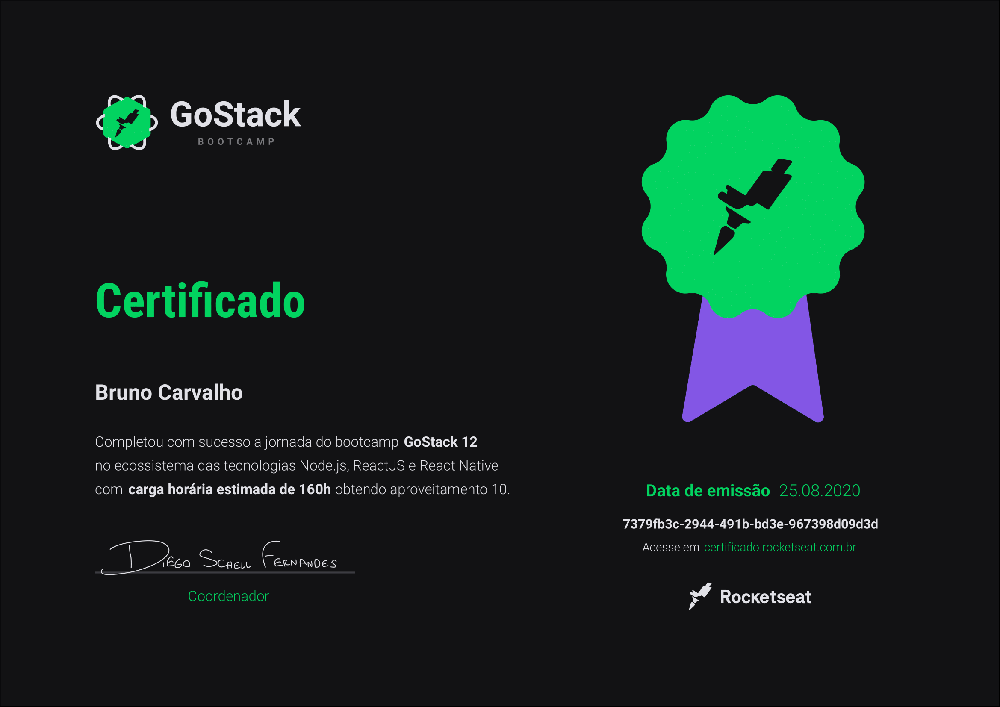

## GoStack
O GoStack foi um bootcamp intensivo com duração média de 4 meses com o foco no aprendizado da stack Node.js, ReactJS, React Native e demais tecnologias e metodologias envolvidas nesse ecossistema de maneira totalmente prática. Alguns temas abordados durante o treinamento:
- JavaScript ES6+
- TypeScript
- ESlint, Prettier e EditorConfig
- CSS3 (Flexbox / Grid)
- Styled Components
- API REST
- Middlewares
- Docker
- TypeORM
- Auth (JWT)
- Testes automatizados (Jest)
- CI/CD
etc

## Certificado

## Desafios Bootcamp GoStack

- [01 - Node e Express](https://github.com/brunodesde1987/rocketseat-gostack/tree/main/bootcamp-gostack-desafio-01)
- [02 - Conceitos do Node.js](https://github.com/brunodesde1987/rocketseat-gostack/tree/main/desafio-conceitos-nodejs)
- [03 - Conceitos do ReactJS](https://github.com/brunodesde1987/rocketseat-gostack/tree/main/desafio-conceitos-reactjs)
- [04 - Conceitos do React Native](https://github.com/brunodesde1987/rocketseat-gostack/tree/main/desafio-conceitos-react-native)
- [05 - Fundamentos do Node.js](https://github.com/brunodesde1987/rocketseat-gostack/tree/main/desafio-fundamentos-nodejs)
- [06 - Banco de dados e upload de arquivos no Node.js](https://github.com/brunodesde1987/rocketseat-gostack/tree/main/desafio-database-upload)
- [07 - GoFinances Web - Fundamentos do ReactJS](https://github.com/brunodesde1987/rocketseat-gostack/tree/main/desafio-fundamentos-reactjs)
- [08 - GoMarketplace - Fundamentos do React Native](https://github.com/brunodesde1987/rocketseat-gostack/tree/main/desafio-fundamentos-react-native)
- [09 - Relacionamentos com banco de dados no Node.js](https://github.com/brunodesde1987/rocketseat-gostack/tree/main/desafio-database-relations)
- [10 - GoRestaurant Web - CRUD ReactJS](https://github.com/brunodesde1987/rocketseat-gostack/tree/main/desafio-reactjs-crud)
- [11 - GoRestaurant Mobile - React Native](https://github.com/brunodesde1987/rocketseat-gostack/tree/main/desafio-react-native-delivery)